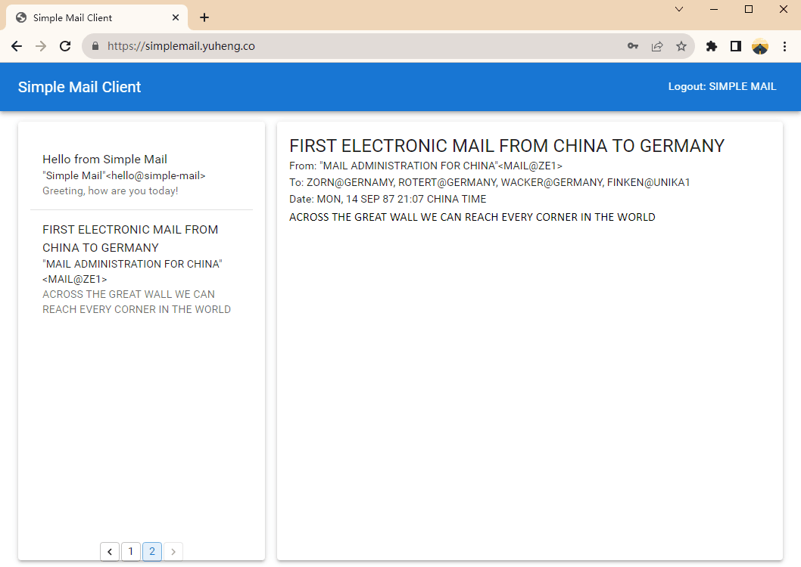

# Simple Mail Web Client

Simple Mail is a web-based email client, with an API proxy to deal with POP3 protocol. It implements subsets of POP3 protocol and MIME format.

This is a containerized application, you can deploy your Simple Mail server using Docker Compose easily.

Try it: https://simplemail.yuheng.co/

Note that as Simple Mail doesn't implement complete POP3 and MIME, it cannot process certail mails.



## Building and Deployment
The building process is handled by the GitHub Actions automatically. Once the building finished, the `simplemail-react` and `simplemail-springboot` docker images will be pushed to the DockerHub.

To deploy Simple Mail, you need to install Docker and Docker Compose first. Then follow these steps:

1. Clone this repository.
2. Enter `Simple-Mail/deployment` directory, open `envoy-config.yaml`, change the domain name `simplemail.yuheng.co` to your depoyment domain name.
3. Apply for a TLS certificate for your domain name, and put the `.crt` and `.key` files in the `Simple-Mail/deployment` directory as `simplemail.crt` and `simplemail.key`.
4. Use docker-compose to start the service:
```bash
docker-compose up -d
```
 
## Architecture
A Simple Mail server is deployed with Docker Compose and has four containers:

* Envoy: Envoy functions as a proxy, serving to establish a TLS-enabled connection environment and directing traffic to either frontend or backend servers based on the URL used in the request.
* React Frontend: This is an nginx container serving built React application.
* Spring Boot API Proxy: The API proxy provides translation between RESTful API and POP3 protocol.
* Redis: The Redis container provides fast in-memory cache for the API proxy, it caches user credentials and email contents.


